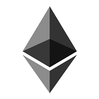

<h3>Exemplo de Smart Contract - Ethereum</h3>

<b>Conceito de contrato inteligente:</b>

Desenvolver um contrato inteligênte permite a criação de um vinculo entre o fornecedor e a empresa contratante (Cliente) de uma forma inteligênte permitindo envio e recebimento de valores (ETH) de forma automática utilizando o próprio contrato, tirando toda a burocracia de realização de depósitos e transferências bancárias.

