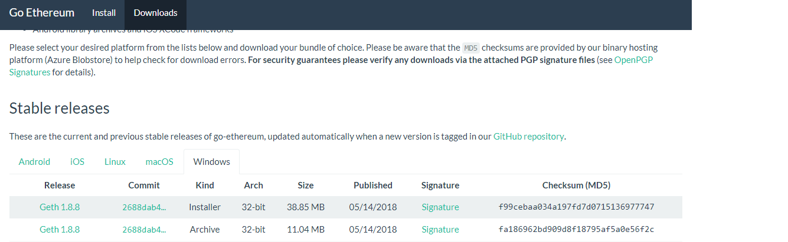
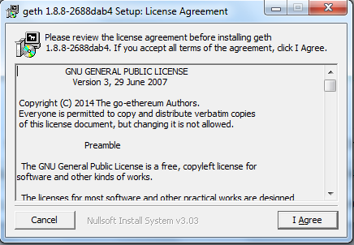
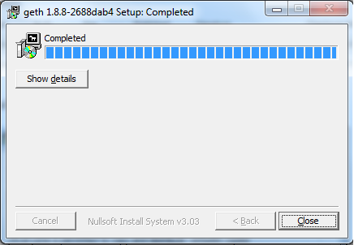
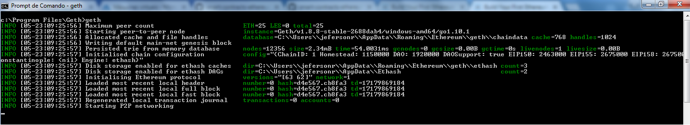

<h3>Exemplo de Smart Contract - Ethereum</h3>

<b>Conceito de contrato inteligente:</b>

Desenvolver um contrato inteligênte permite a criação de um vinculo entre o fornecedor e a empresa contratante (Cliente) de uma forma inteligênte permitindo envio e recebimento de valores (ETH) de forma automática utilizando o próprio contrato, tirando toda a burocracia de realização de depósitos e transferências bancárias e o pagamento de taxa por utilização desses serviços.

<b>Criando o ambiente:</b>

Para esse processo estou utilizando a plataforma do Microsoft Azure Student com o ambiente Linux Ubuntu Server, se você não tem acesso aos serviços do Microsoft Azure você pode utilizar uma máquina virtual (VM) com a distribuição do Linux Ubuntu para seguir os passos abaixo.

<b>Configurando um Nó no Ethereum (ETH)</b>

Um nó é qualquer dispositivo (Smartphone, Computador, Notebook e etc) que faça parte da rede blockchain da rede Ethereum, esses nós podem ser programado em diversas tecnologias, nesse tutorial estarei utilizando a tecnologia GO, antes de começarmos a programação vamos realizar o download da plataforma Geth (https://geth.ethereum.org/downloads/) 

Após esse processo você deve realizar a instalação do Geth em sua respectiva máquina

&nbsp;&nbsp;

Após esse processo você deve acessar o diretório C:\Program Files\Geth e rodar o comando <b>geth</b> após esse processo você esta rodando um ethereum node

Crie um diderório blockchain_privada, acesse o mesmo e rode o comando <b>mkdir chaindata</b> em seguida abra um editor de texto (notepad ++) e copie e cole o código abaixo:

